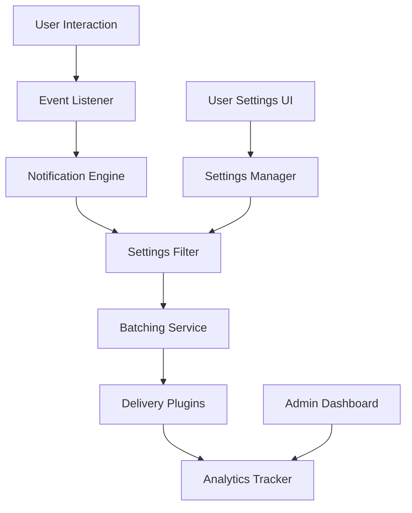

# Design Document

## Overview

The comprehensive notification system will be built as a modular, extensible architecture that captures all user interactions and delivers notifications through multiple channels. The system will use an event-driven approach with a plugin-based delivery system, allowing easy addition of new notification types and delivery channels.

## Architecture

### Core Components

1. **Notification Engine**: Central orchestrator that processes events and creates notifications
2. **Event Listeners**: Hooks into existing mutations to capture user interactions
3. **Delivery Channel Plugins**: Modular system for different notification delivery methods
4. **Notification Settings Manager**: Handles user preferences and filtering
5. **Batching & Timing Service**: Manages notification frequency and intelligent delivery timing
6. **Analytics Tracker**: Monitors delivery success and user engagement

### System Flow



## Components and Interfaces

### 1. Notification Types Registry

```typescript
interface NotificationType {
  id: string;
  name: string;
  description: string;
  category: 'engagement' | 'social' | 'content' | 'system';
  priority: 'low' | 'medium' | 'high';
  batchable: boolean;
  defaultChannels: DeliveryChannel[];
}

const NOTIFICATION_TYPES: Record<string, NotificationType> = {
  NEW_FOLLOWER: {
    id: 'new_follower',
    name: 'New Follower',
    description: 'Someone started following you',
    category: 'social',
    priority: 'medium',
    batchable: true,
    defaultChannels: ['in_app', 'email']
  },
  FOLLOWER_NEW_POST: {
    id: 'follower_new_post',
    name: 'New Post from Following',
    description: 'Someone you follow posted new content',
    category: 'content',
    priority: 'low',
    batchable: true,
    defaultChannels: ['in_app']
  },
  CONTENT_LIKED: {
    id: 'content_liked',
    name: 'Content Liked',
    description: 'Someone liked your content',
    category: 'engagement',
    priority: 'low',
    batchable: true,
    defaultChannels: ['in_app']
  },
  CONTENT_CLAPPED: {
    id: 'content_clapped',
    name: 'Content Clapped',
    description: 'Someone clapped for your content',
    category: 'engagement',
    priority: 'medium',
    batchable: true,
    defaultChannels: ['in_app', 'email']
  },
  CONTENT_COMMENTED: {
    id: 'content_commented',
    name: 'New Comment',
    description: 'Someone commented on your content',
    category: 'engagement',
    priority: 'medium',
    batchable: false,
    defaultChannels: ['in_app', 'email']
  },
  COMMENT_REPLY: {
    id: 'comment_reply',
    name: 'Comment Reply',
    description: 'Someone replied to your comment',
    category: 'engagement',
    priority: 'medium',
    batchable: false,
    defaultChannels: ['in_app', 'email']
  },
  CONTENT_PAYMENT: {
    id: 'content_payment',
    name: 'Content Payment',
    description: 'Someone paid to access your content',
    category: 'engagement',
    priority: 'high',
    batchable: false,
    defaultChannels: ['in_app', 'email']
  },
  USER_MENTIONED: {
    id: 'user_mentioned',
    name: 'User Mentioned',
    description: 'You were mentioned in content or comments',
    category: 'social',
    priority: 'high',
    batchable: false,
    defaultChannels: ['in_app', 'email']
  }
};
```

### 2. Delivery Channel System

```typescript
interface DeliveryChannel {
  id: string;
  name: string;
  description: string;
  enabled: boolean;
  requiresSetup: boolean;
  setupFields?: string[];
}

interface DeliveryPlugin {
  channel: DeliveryChannel;
  send(notification: ProcessedNotification, userSettings: UserChannelSettings): Promise<DeliveryResult>;
  validateSettings(settings: any): boolean;
}

interface DeliveryResult {
  success: boolean;
  messageId?: string;
  error?: string;
  retryable: boolean;
}
```

### 3. Enhanced Notification Schema

```typescript
// Extended notifications table schema
notifications: defineTable({
  userId: v.id("users"),
  type: v.string(),
  title: v.string(),
  message: v.string(),
  isRead: v.boolean(),
  
  // Enhanced fields
  category: v.string(), // 'engagement' | 'social' | 'content' | 'system'
  priority: v.string(), // 'low' | 'medium' | 'high'
  
  // Related content
  relatedContentType: v.optional(v.string()), // 'article' | 'reel' | 'comment' | 'user'
  relatedContentId: v.optional(v.string()),
  
  // Actor information (who triggered the notification)
  actorUserId: v.optional(v.id("users")),
  
  // Batching
  batchId: v.optional(v.string()),
  batchCount: v.optional(v.number()),
  
  // Delivery tracking
  deliveryChannels: v.array(v.string()),
  deliveryStatus: v.object({
    in_app: v.optional(v.object({
      delivered: v.boolean(),
      deliveredAt: v.optional(v.number()),
      viewed: v.optional(v.boolean()),
      viewedAt: v.optional(v.number())
    })),
    email: v.optional(v.object({
      delivered: v.boolean(),
      deliveredAt: v.optional(v.number()),
      messageId: v.optional(v.string()),
      opened: v.optional(v.boolean()),
      openedAt: v.optional(v.number()),
      error: v.optional(v.string())
    })),
    whatsapp: v.optional(v.object({
      delivered: v.boolean(),
      deliveredAt: v.optional(v.number()),
      messageId: v.optional(v.string()),
      error: v.optional(v.string())
    })),
    sms: v.optional(v.object({
      delivered: v.boolean(),
      deliveredAt: v.optional(v.number()),
      messageId: v.optional(v.string()),
      error: v.optional(v.string())
    }))
  }),
  
  createdAt: v.number(),
  scheduledFor: v.optional(v.number()), // For delayed delivery
  expiresAt: v.optional(v.number())
}).index("by_user", ["userId"])
  .index("by_user_unread", ["userId", "isRead"])
  .index("by_type", ["type"])
  .index("by_priority", ["priority"])
  .index("by_scheduled", ["scheduledFor"])
  .index("by_batch", ["batchId"]);

// User notification settings
notificationSettings: defineTable({
  userId: v.id("users"),
  notificationType: v.string(),
  enabled: v.boolean(),
  channels: v.object({
    in_app: v.boolean(),
    email: v.boolean(),
    whatsapp: v.boolean(),
    sms: v.boolean(),
    push: v.boolean()
  }),
  quietHours: v.optional(v.object({
    enabled: v.boolean(),
    startTime: v.string(), // "22:00"
    endTime: v.string(), // "08:00"
    timezone: v.string()
  })),
  batchingPreference: v.string(), // 'immediate' | 'batched' | 'digest'
  updatedAt: v.number()
}).index("by_user", ["userId"])
  .index("by_user_type", ["userId", "notificationType"]);
```

### 4. Event Listener Integration

The system will integrate with existing mutations by adding notification triggers:

```typescript
// Example: Enhanced likeArticle mutation
export const likeArticle = mutation({
  args: { articleId: v.id("articles") },
  handler: async (ctx, args) => {
    const userId = await getAuthUserId(ctx);
    if (!userId) throw new Error("Not authenticated");

    // Existing like logic...
    const existingLike = await ctx.db
      .query("likes")
      .withIndex("by_user_article", (q) => 
        q.eq("userId", userId).eq("articleId", args.articleId)
      )
      .first();

    let result;
    if (existingLike) {
      await ctx.db.delete(existingLike._id);
      result = { liked: false };
    } else {
      await ctx.db.insert("likes", {
        userId,
        articleId: args.articleId,
        createdAt: Date.now(),
      });
      result = { liked: true };
      
      // NEW: Trigger notification
      const article = await ctx.db.get(args.articleId);
      if (article && article.authorId !== userId) {
        await ctx.runMutation(internal.notifications.createNotificationEvent, {
          type: 'CONTENT_LIKED',
          recipientUserId: article.authorId,
          actorUserId: userId,
          relatedContentType: 'article',
          relatedContentId: args.articleId
        });
      }
    }

    return result;
  },
});
```

## Data Models

### Notification Processing Pipeline

```typescript
interface NotificationEvent {
  type: string;
  recipientUserId: string;
  actorUserId?: string;
  relatedContentType?: string;
  relatedContentId?: string;
  metadata?: Record<string, any>;
}

interface ProcessedNotification {
  id: string;
  userId: string;
  type: string;
  title: string;
  message: string;
  category: string;
  priority: string;
  relatedContent?: {
    type: string;
    id: string;
    title?: string;
    url?: string;
  };
  actor?: {
    id: string;
    name: string;
    username: string;
    avatar?: string;
  };
  batchInfo?: {
    id: string;
    count: number;
    summary: string;
  };
  deliveryChannels: string[];
  scheduledFor?: number;
}
```

### User Settings Model

```typescript
interface UserNotificationSettings {
  userId: string;
  globalSettings: {
    enabled: boolean;
    quietHours: {
      enabled: boolean;
      startTime: string;
      endTime: string;
      timezone: string;
    };
    batchingPreference: 'immediate' | 'batched' | 'digest';
  };
  typeSettings: Record<string, {
    enabled: boolean;
    channels: {
      in_app: boolean;
      email: boolean;
      whatsapp: boolean;
      sms: boolean;
      push: boolean;
    };
  }>;
  channelSettings: {
    email: {
      address: string;
      verified: boolean;
    };
    whatsapp: {
      phoneNumber?: string;
      verified: boolean;
    };
    sms: {
      phoneNumber?: string;
      verified: boolean;
    };
  };
}
```

## Error Handling

### Delivery Failure Strategy

1. **Immediate Retry**: For transient failures (network issues)
2. **Exponential Backoff**: For service unavailability
3. **Fallback Channels**: If primary channel fails, try secondary
4. **Dead Letter Queue**: For permanently failed notifications
5. **User Notification**: Inform users of delivery issues in settings

### Error Types

```typescript
enum NotificationError {
  INVALID_RECIPIENT = 'invalid_recipient',
  CHANNEL_UNAVAILABLE = 'channel_unavailable',
  RATE_LIMITED = 'rate_limited',
  INVALID_SETTINGS = 'invalid_settings',
  CONTENT_NOT_FOUND = 'content_not_found',
  PERMISSION_DENIED = 'permission_denied'
}
```

## Testing Strategy

### Unit Tests

1. **Notification Type Registry**: Test type definitions and validation
2. **Event Listeners**: Test notification triggering for each interaction
3. **Delivery Plugins**: Test each channel's send functionality
4. **Settings Manager**: Test preference filtering and validation
5. **Batching Service**: Test grouping and timing logic

### Integration Tests

1. **End-to-End Flows**: Test complete notification journey from trigger to delivery
2. **Channel Integration**: Test actual delivery through each channel
3. **Settings Persistence**: Test user preference storage and retrieval
4. **Error Scenarios**: Test failure handling and recovery

### Performance Tests

1. **High Volume**: Test system under notification spikes
2. **Batching Efficiency**: Test batching reduces delivery load
3. **Database Performance**: Test query performance with large notification volumes
4. **Channel Throughput**: Test delivery rate limits and queuing

### User Acceptance Tests

1. **Settings UI**: Test user can configure all preferences
2. **Notification Display**: Test in-app notification rendering
3. **Channel Verification**: Test users can verify delivery channels
4. **Preference Persistence**: Test settings are maintained across sessions

## Implementation Phases

### Phase 1: Core Infrastructure
- Enhanced notification schema
- Notification engine and event system
- Basic in-app delivery
- Settings management foundation

### Phase 2: Event Integration
- Add notification triggers to all existing mutations
- Implement all notification types
- Basic user settings UI

### Phase 3: Multi-Channel Delivery
- Email delivery plugin (enhance existing)
- WhatsApp delivery plugin
- SMS delivery plugin
- Channel verification system

### Phase 4: Advanced Features
- Batching and intelligent timing
- Analytics and reporting
- Advanced settings (quiet hours, digest mode)
- Performance optimization

### Phase 5: Analytics & Optimization
- Delivery analytics dashboard
- User engagement tracking
- A/B testing for notification content
- Performance monitoring and alerting