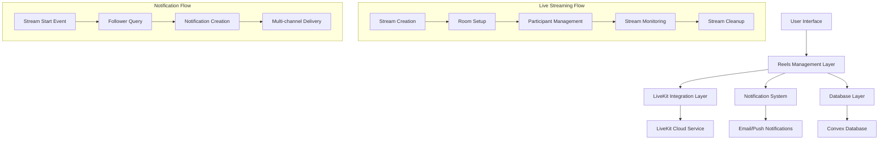

# Design Document

## Overview

This design document outlines the implementation of live streaming capabilities for the reels system using LiveKit SDK. The solution integrates seamlessly with the existing reels infrastructure while adding real-time video broadcasting, viewer management, and notification systems.

The design leverages the existing notification system to alert followers when live streams begin, uses the current reels database schema with extensions for live streaming metadata, and provides a unified interface where users can choose between uploading videos or going live.

## Architecture

### High-Level Architecture



### Component Architecture

The live streaming feature will be built using the following component hierarchy:

1. **ReelsScreen** (Enhanced) - Main interface with upload/live options
2. **LiveStreamCreator** (New) - Stream setup and configuration
3. **LiveStreamViewer** (New) - Real-time stream viewing
4. **LiveStreamControls** (New) - Broadcaster controls
5. **LiveStreamNotifications** (Enhanced) - Integration with existing notification system

## Components and Interfaces

### Database Schema Extensions

#### Live Streams Table
```typescript
liveStreams: defineTable({
  authorId: v.id("users"),
  title: v.string(),
  description: v.optional(v.string()),
  roomName: v.string(), // LiveKit room identifier
  status: v.string(), // 'preparing' | 'live' | 'ended' | 'error'
  startedAt: v.optional(v.number()),
  endedAt: v.optional(v.number()),
  viewerCount: v.number(),
  maxViewers: v.number(),
  tags: v.array(v.string()),
  isSensitive: v.boolean(),
  isGated: v.boolean(),
  priceToken: v.optional(v.string()),
  priceAmount: v.optional(v.number()),
  sellerAddress: v.optional(v.string()),
  recordingUrl: v.optional(v.string()), // If saved as reel
  createdAt: v.number(),
}).index("by_author", ["authorId"])
  .index("by_status", ["status"])
  .index("by_created", ["createdAt"])
```

#### Live Stream Participants Table
```typescript
liveStreamParticipants: defineTable({
  streamId: v.id("liveStreams"),
  userId: v.id("users"),
  role: v.string(), // 'broadcaster' | 'viewer'
  joinedAt: v.number(),
  leftAt: v.optional(v.number()),
  duration: v.optional(v.number()),
}).index("by_stream", ["streamId"])
  .index("by_user", ["userId"])
  .index("by_stream_user", ["streamId", "userId"])
```

### LiveKit Integration Layer

#### LiveKit Service Interface
```typescript
interface LiveKitService {
  createRoom(roomName: string, options: RoomOptions): Promise<Room>;
  generateToken(roomName: string, identity: string, role: 'broadcaster' | 'viewer'): Promise<string>;
  getRoomInfo(roomName: string): Promise<RoomInfo>;
  endRoom(roomName: string): Promise<void>;
  getParticipants(roomName: string): Promise<Participant[]>;
}
```

#### Room Configuration
```typescript
interface RoomOptions {
  maxParticipants: number;
  emptyTimeout: number; // Auto-close when empty
  enableRecording: boolean;
  enableChat: boolean;
  videoCodec: 'h264' | 'vp8' | 'vp9';
  audioCodec: 'opus' | 'aac';
}
```

### Frontend Components

#### LiveStreamCreator Component
```typescript
interface LiveStreamCreatorProps {
  onStreamCreated: (streamId: string) => void;
  onCancel: () => void;
}

interface LiveStreamCreatorState {
  title: string;
  description: string;
  tags: string[];
  isSensitive: boolean;
  isGated: boolean;
  priceAmount?: number;
  priceToken?: string;
  cameraEnabled: boolean;
  microphoneEnabled: boolean;
  isCreating: boolean;
}
```

#### LiveStreamViewer Component
```typescript
interface LiveStreamViewerProps {
  streamId: string;
  onLeave: () => void;
  onNavigate?: (screen: string, data?: any) => void;
}

interface LiveStreamViewerState {
  isConnected: boolean;
  viewerCount: number;
  streamStatus: 'connecting' | 'live' | 'ended' | 'error';
  hasAudio: boolean;
  hasVideo: boolean;
}
```

#### LiveStreamControls Component
```typescript
interface LiveStreamControlsProps {
  streamId: string;
  onEndStream: () => void;
  onToggleCamera: () => void;
  onToggleMicrophone: () => void;
}

interface LiveStreamControlsState {
  cameraEnabled: boolean;
  microphoneEnabled: boolean;
  viewerCount: number;
  duration: number;
  isEnding: boolean;
}
```

### Backend API Functions

#### Stream Management
```typescript
// Create new live stream
export const createLiveStream = mutation({
  args: {
    title: v.string(),
    description: v.optional(v.string()),
    tags: v.array(v.string()),
    isSensitive: v.boolean(),
    isGated: v.boolean(),
    priceToken: v.optional(v.string()),
    priceAmount: v.optional(v.number()),
  },
  handler: async (ctx, args) => {
    // Implementation details
  }
});

// Join live stream as viewer
export const joinLiveStream = mutation({
  args: { streamId: v.id("liveStreams") },
  handler: async (ctx, args) => {
    // Implementation details
  }
});

// End live stream
export const endLiveStream = mutation({
  args: { 
    streamId: v.id("liveStreams"),
    saveAsReel: v.optional(v.boolean())
  },
  handler: async (ctx, args) => {
    // Implementation details
  }
});
```

## Data Models

### Live Stream Entity
```typescript
interface LiveStream {
  _id: Id<"liveStreams">;
  authorId: Id<"users">;
  title: string;
  description?: string;
  roomName: string;
  status: 'preparing' | 'live' | 'ended' | 'error';
  startedAt?: number;
  endedAt?: number;
  viewerCount: number;
  maxViewers: number;
  tags: string[];
  isSensitive: boolean;
  isGated: boolean;
  priceToken?: string;
  priceAmount?: number;
  sellerAddress?: string;
  recordingUrl?: string;
  createdAt: number;
}
```

### Live Stream Participant Entity
```typescript
interface LiveStreamParticipant {
  _id: Id<"liveStreamParticipants">;
  streamId: Id<"liveStreams">;
  userId: Id<"users">;
  role: 'broadcaster' | 'viewer';
  joinedAt: number;
  leftAt?: number;
  duration?: number;
}
```

### LiveKit Token Payload
```typescript
interface LiveKitTokenPayload {
  identity: string; // User ID
  name: string; // Display name
  room: string; // Room name
  role: 'broadcaster' | 'viewer';
  permissions: {
    canPublish: boolean;
    canSubscribe: boolean;
    canPublishData: boolean;
  };
}
```

## Error Handling

### Stream Creation Errors
- **Camera/Microphone Access Denied**: Display user-friendly message with instructions
- **LiveKit Room Creation Failed**: Retry mechanism with exponential backoff
- **Network Connectivity Issues**: Offline detection and reconnection logic
- **Invalid Stream Configuration**: Client-side validation with clear error messages

### Stream Viewing Errors
- **Stream Not Found**: Redirect to reels feed with notification
- **Stream Ended**: Display end message with option to view other content
- **Connection Lost**: Automatic reconnection with progress indicator
- **Insufficient Permissions**: Payment flow for gated content

### Notification Errors
- **Follower Query Failed**: Log error but continue with stream creation
- **Notification Delivery Failed**: Use existing retry mechanisms
- **Email Service Unavailable**: Fallback to in-app notifications only

## Testing Strategy

### Unit Tests
- LiveKit service integration functions
- Stream state management logic
- Notification creation and delivery
- Database operations for live streams
- Token generation and validation

### Integration Tests
- End-to-end stream creation flow
- Viewer joining and leaving streams
- Notification delivery to followers
- Stream recording and conversion to reels
- Payment flow for gated streams

### Performance Tests
- Concurrent stream handling
- Viewer capacity limits
- Database query performance
- Notification system load testing
- LiveKit room management efficiency

### User Experience Tests
- Camera/microphone permission flows
- Network interruption recovery
- Cross-device compatibility
- Accessibility compliance
- Mobile responsiveness

## Security Considerations

### Authentication and Authorization
- Verify user authentication before stream creation
- Validate stream ownership for control operations
- Implement role-based access for LiveKit rooms
- Secure token generation with proper expiration

### Data Protection
- Encrypt sensitive stream metadata
- Secure LiveKit API credentials
- Implement rate limiting for stream operations
- Validate all user inputs and sanitize data

### Privacy Controls
- Respect user notification preferences
- Implement stream visibility controls
- Secure payment information for gated streams
- Comply with data retention policies

## Performance Optimization

### Frontend Optimizations
- Lazy load LiveKit SDK components
- Implement efficient video rendering
- Optimize notification polling
- Cache stream metadata locally
- Minimize re-renders during streaming

### Backend Optimizations
- Efficient database queries with proper indexing
- Batch notification processing
- Connection pooling for LiveKit API
- Implement caching for frequently accessed data
- Optimize real-time updates using Convex subscriptions

### LiveKit Optimizations
- Configure appropriate video/audio codecs
- Implement adaptive bitrate streaming
- Optimize room settings for performance
- Use efficient participant management
- Implement proper cleanup procedures