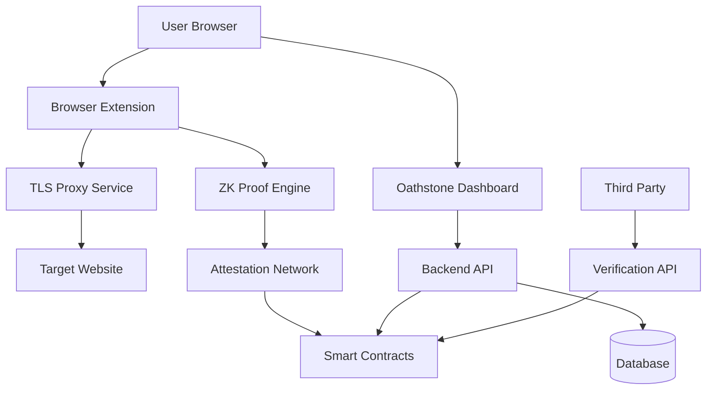

# Oathstone AutomateProofs Implementation
## Product & Technical Requirements Document

**Version:** 2.0  
**Date:** January 2025  
**Project:** Oathstone Codepen Dashboard - AutomateProofs Integration  

---

## Table of Contents

1. [Executive Summary](#executive-summary)
2. [Product Requirements](#product-requirements)
3. [Technical Requirements](#technical-requirements)
4. [System Architecture](#system-architecture)
5. [Implementation Phases](#implementation-phases)
6. [Security Considerations](#security-considerations)
7. [API Specifications](#api-specifications)
8. [Convex Database Schema](#convex-database-schema)
9. [Testing Strategy](#testing-strategy)
10. [Deployment & Operations](#deployment--operations)

---

## Executive Summary

### Project Overview
This document outlines the requirements for building AutomateProofs, a no-code automation platform integrated into the Oathstone Codepen Dashboard. The implementation will enable users to create automated proof workflows through a drag-and-drop interface without requiring technical knowledge.

### Key Objectives
- Create a no-code drag-and-drop interface for automation workflows
- Enable browser automation on both web and mobile platforms
- Allow users to capture screenshots and extract data automatically
- Integrate seamlessly with existing Oathstone dashboard without disrupting current functionality
- Use Convex as the primary database for all automation data
- Provide attestation capabilities for proof verification

### Success Metrics
- Users can create automation workflows within 5 minutes without technical knowledge
- Support for both desktop and mobile browser automation
- 95% success rate for automated proof generation
- Integration with existing Oathstone features without breaking changes
- Support for 20+ common web interaction patterns

---

## Product Requirements

### 1. Core Features

#### 1.1 AutomateProofs Dashboard Component
**User Story:** As a user, I want to access automation tools directly from my existing Oathstone dashboard without disrupting my current workflow.

**Requirements:**
- New "AutomateProofs" component integrated into existing dashboard
- Seamless navigation alongside current wallet and smart contract features
- Maintains all existing functionality without breaking changes
- Responsive design matching current Oathstone UI/UX patterns
- Real-time status updates for running automations

**Acceptance Criteria:**
- Component loads within existing dashboard structure
- No impact on current wallet or smart contract functionality
- Consistent styling with existing Tailwind CSS theme
- Mobile-responsive interface matching current design
- Integration with existing Convex Auth system

#### 1.2 Drag-and-Drop Workflow Builder
**User Story:** As a non-technical user, I want to create automation workflows by dragging and dropping visual elements without writing code.

**Requirements:**
- Visual workflow builder with drag-and-drop interface
- Pre-built action blocks for common web interactions
- Flow control elements (conditions, loops, delays)
- Visual connection system between workflow steps
- Template library for common automation patterns
- Real-time workflow validation and error highlighting

**Acceptance Criteria:**
- Users can create workflows without technical knowledge
- Drag-and-drop interface works on both desktop and mobile
- Visual feedback for valid/invalid connections
- Workflow templates for banking, social media, and identity verification
- Save and load workflow functionality

#### 1.3 Browser Automation Engine
**User Story:** As a user, I want to automate interactions with websites on both desktop and mobile browsers to collect proof data.

**Requirements:**
- Cross-platform browser automation (Chrome, Firefox, Safari, Mobile browsers)
- Web interaction capabilities (click, type, scroll, wait)
- Screenshot capture at any workflow step
- Data extraction from web elements (text, attributes, images)
- Mobile-specific gestures (tap, swipe, pinch)
- Headless and headed browser modes

**Acceptance Criteria:**
- Support for major desktop and mobile browsers
- Reliable element detection and interaction
- High-quality screenshot capture
- Accurate data extraction from web elements
- Mobile automation works on iOS and Android
- Automation runs in both visible and background modes

#### 1.4 Attestation and Verification System
**User Story:** As a user, I want my automated proofs to be verified by attestors to ensure their authenticity.

**Requirements:**
- Integration with attestor network for proof verification
- Automated submission of proofs for attestation
- Real-time attestation status tracking
- Proof verification API for third parties
- Integration with existing smart contract infrastructure

**Acceptance Criteria:**
- Automated proofs are submitted for attestation
- Users can track attestation progress in real-time
- Third parties can verify proofs through API
- Integration with existing Oathstone smart contracts
- Attestation results stored in Convex database

### 2. User Experience Requirements

#### 2.1 Dashboard Integration
- New "AutomateProofs" tab in existing navigation structure
- Maintains current dashboard layout and styling
- No disruption to existing wallet and smart contract features
- Consistent user experience with current Oathstone interface
- Real-time notifications for automation status

#### 2.2 No-Code Interface Design
- Intuitive drag-and-drop workflow builder
- Visual programming concepts accessible to non-technical users
- Clear visual feedback for all user actions
- Contextual help and tooltips throughout interface
- Error prevention and clear error messaging

#### 2.3 Mobile-First Automation
- Touch-optimized workflow builder for mobile devices
- Mobile browser automation capabilities
- Responsive design for all screen sizes
- Mobile-specific interaction patterns (swipe, tap, pinch)
- Offline workflow editing capabilities

#### 2.4 Educational and Onboarding
- Interactive tutorial for workflow creation
- Template gallery with pre-built automation examples
- Step-by-step guides for common use cases
- Video tutorials embedded in interface
- Community-shared workflow templates

### 3. Automation Workflow Types (Phase 1)

#### 3.1 Web Interaction Workflows
- **Navigation Actions**
  - Open URL in browser
  - Navigate to specific pages
  - Handle redirects and popups
  - Manage browser tabs and windows
  
- **Input Actions**
  - Fill text fields (username, password, forms)
  - Select dropdown options
  - Check/uncheck checkboxes
  - Upload files and documents

#### 3.2 Data Extraction Workflows
- **Content Capture**
  - Screenshot entire page or specific elements
  - Extract text from web elements
  - Capture images and media
  - Download files and documents
  
- **Data Validation**
  - Verify element presence
  - Check text content matches patterns
  - Validate data formats (dates, numbers, emails)
  - Compare extracted data against expected values

#### 3.3 Mobile-Specific Workflows
- **Touch Interactions**
  - Tap elements and buttons
  - Swipe gestures (left, right, up, down)
  - Pinch to zoom
  - Long press actions
  
- **Mobile Features**
  - Camera access for photo capture
  - Location services integration
  - Device orientation handling
  - Mobile keyboard interactions

#### 3.4 Proof Generation Workflows
- **Automated Verification**
  - Login to services automatically
  - Navigate to proof data pages
  - Extract relevant information
  - Generate cryptographic proofs
  - Submit for attestation

---

## Technical Requirements

### 1. Core Components

#### 1.1 AutomateProofs React Component
**Purpose:** Integrate automation interface into existing Oathstone dashboard without breaking changes.

**Technical Specifications:**
- **Framework:** React 18+ with TypeScript (matching existing stack)
- **Styling:** Tailwind CSS (consistent with current dashboard)
- **State Management:** Zustand for automation state
- **Integration:** Seamless integration with existing App.tsx structure
- **Routing:** Add new route without disrupting current navigation

**Component Structure:**
```typescript
interface AutomateProofsProps {
  currentNetwork: "testnet" | "mainnet";
  userWallet: WalletData;
}

const AutomateProofs: React.FC<AutomateProofsProps> = ({
  currentNetwork,
  userWallet
}) => {
  return (
    <div className="automation-dashboard">
      <WorkflowBuilder />
      <AutomationRunner />
      <ProofManager />
    </div>
  );
};
```

#### 1.2 Drag-and-Drop Workflow Builder
**Purpose:** Visual workflow creation interface for non-technical users.

**Technical Specifications:**
- **Library:** React DnD or React Flow for drag-and-drop functionality
- **Canvas:** HTML5 Canvas or SVG for workflow visualization
- **State Management:** Workflow state stored in Convex
- **Validation:** Real-time workflow validation and error checking

**Workflow Node Types:**
```typescript
interface WorkflowNode {
  id: string;
  type: 'action' | 'condition' | 'loop' | 'screenshot' | 'extract';
  position: { x: number; y: number };
  data: {
    label: string;
    config: Record<string, any>;
    inputs: WorkflowInput[];
    outputs: WorkflowOutput[];
  };
}

interface WorkflowEdge {
  id: string;
  source: string;
  target: string;
  type: 'default' | 'conditional';
}
```

#### 1.3 Browser Automation Engine
**Purpose:** Execute automated browser interactions on web and mobile platforms.

**Technical Specifications:**
- **Desktop Automation:** Puppeteer for Chrome/Chromium automation
- **Mobile Automation:** Appium or WebDriver for mobile browser control
- **Cross-Platform:** Support for Chrome, Firefox, Safari, Mobile browsers
- **Execution Environment:** Node.js backend service integrated with Convex

**Automation Interface:**
```typescript
interface AutomationEngine {
  launchBrowser(config: BrowserConfig): Promise<BrowserInstance>;
  executeWorkflow(workflow: Workflow, browser: BrowserInstance): Promise<ExecutionResult>;
  captureScreenshot(element?: string): Promise<Buffer>;
  extractData(selector: string, type: 'text' | 'attribute' | 'image'): Promise<any>;
  performAction(action: AutomationAction): Promise<void>;
}

interface AutomationAction {
  type: 'click' | 'type' | 'scroll' | 'wait' | 'navigate' | 'swipe' | 'tap';
  target: string; // CSS selector or coordinates
  value?: string | number;
  options?: Record<string, any>;
}
```

#### 1.4 Convex Integration Layer
**Purpose:** Manage all automation data using existing Convex infrastructure.

**Technical Specifications:**
- **Database:** Convex (replacing PostgreSQL from original design)
- **Real-time Updates:** Convex subscriptions for live workflow status
- **Authentication:** Integration with existing Convex Auth
- **File Storage:** Convex file storage for screenshots and extracted data

**Convex Functions:**
```typescript
// convex/automations.ts
export const createWorkflow = mutation({
  args: {
    name: v.string(),
    description: v.string(),
    nodes: v.array(v.any()),
    edges: v.array(v.any())
  },
  handler: async (ctx, args) => {
    const userId = await getAuthUserId(ctx);
    return await ctx.db.insert("workflows", {
      userId,
      ...args,
      status: "draft",
      createdAt: Date.now()
    });
  }
});

export const executeWorkflow = mutation({
  args: { workflowId: v.id("workflows") },
  handler: async (ctx, args) => {
    // Trigger automation execution
    await ctx.scheduler.runAfter(0, "automations:runWorkflow", {
      workflowId: args.workflowId
    });
  }
});
```

### 2. Infrastructure Requirements

#### 2.1 Convex Backend Integration

**Database and Backend**
- **Primary Database:** Convex (existing infrastructure)
- **Authentication:** Existing Convex Auth system
- **Real-time Updates:** Convex subscriptions for live data
- **File Storage:** Convex file storage for screenshots and documents
- **Scheduled Functions:** Convex cron jobs for automation execution

**Automation Execution Service**
- **Runtime:** Node.js service integrated with Convex
- **Browser Control:** Puppeteer for desktop, Appium for mobile
- **Scaling:** Convex functions with automatic scaling
- **Monitoring:** Built-in Convex dashboard monitoring

#### 2.2 Frontend Integration

**Dashboard Component Updates**
- **Framework:** React 18+ with TypeScript (existing)
- **Styling:** Tailwind CSS (existing theme)
- **State Management:** Zustand for automation-specific state
- **Integration:** New component in existing App.tsx structure
- **Navigation:** Additional tab in current navigation system

**Mobile Automation Interface**
- **Responsive Design:** Existing mobile-responsive framework
- **Touch Interactions:** Touch-optimized drag-and-drop
- **Mobile Testing:** Real device testing capabilities
- **Progressive Web App:** Existing PWA infrastructure

### 3. Security and Proof Requirements

#### 3.1 Data Security
- **Encryption:** AES-256 for sensitive automation data
- **Secure Storage:** Convex built-in encryption for stored workflows
- **Authentication:** Existing Convex Auth integration
- **Access Control:** User-based workflow access permissions

#### 3.2 Proof Generation
- **Screenshot Integrity:** SHA-256 hashing of captured images
- **Data Verification:** Cryptographic signatures for extracted data
- **Timestamp Proofs:** Blockchain-based timestamp verification
- **Attestation:** Integration with existing smart contract infrastructure

#### 3.3 Browser Security
- **Sandboxing:** Isolated browser instances for each automation
- **Privacy:** No persistent data storage in automated browsers
- **Network Security:** VPN and proxy support for automation
- **Credential Protection:** Secure handling of login credentials

---

## System Architecture

### 1. High-Level Architecture



### 2. Component Interactions

#### 2.1 Credential Creation Flow
1. User initiates credential creation via dashboard
2. Browser extension intercepts TLS traffic to target website
3. TLS proxy extracts encrypted response data
4. User selects data elements for selective reveal
5. ZK proof engine generates proof of selective reveal
6. Attestation network verifies the claim
7. Smart contract stores verified credential
8. User receives verifiable credential token

#### 2.2 Verification Flow
1. Third party receives credential from user
2. Verification API validates credential format
3. Smart contract lookup confirms attestation signatures
4. ZK proof verification confirms data integrity
5. Result returned to verifier

### 3. Data Flow Architecture

#### 3.1 TLS Data Processing
```typescript
interface TLSDataFlow {
  // Raw TLS traffic
  encryptedRequest: Buffer;
  encryptedResponse: Buffer;
  
  // Extracted session data
  sessionKeys: {
    sendingKey: Buffer;
    receivingKey: Buffer;
  };
  
  // Processed for ZK proof
  selectiveReveal: {
    revealedData: string;
    hiddenDataMask: boolean[];
    proofInputs: ZKProofInputs;
  };
}
```

#### 3.2 Credential Storage
```typescript
interface CredentialData {
  id: string;
  userId: string;
  provider: string;
  claimType: string;
  zkProof: {
    proof: Uint8Array;
    publicSignals: string[];
    verificationKey: VerificationKey;
  };
  attestations: {
    attestorId: string;
    signature: string;
    timestamp: number;
  }[];
  metadata: {
    createdAt: number;
    expiresAt?: number;
    revoked: boolean;
  };
}
```

---

## Implementation Phases

### Phase 1: AutomateProofs Dashboard Integration (Months 1-2)

#### 1.1 Dashboard Component Development
**Week 1-2: Component Setup**
- Create AutomateProofs React component
- Integrate with existing App.tsx without breaking changes
- Add new navigation tab to existing structure
- Implement basic component routing and state management

**Week 3-4: Drag-and-Drop Interface**
- Implement visual workflow builder using React Flow
- Create drag-and-drop node library (actions, conditions, loops)
- Build workflow canvas with zoom and pan capabilities
- Add workflow validation and error highlighting

**Week 5-6: Convex Integration**
- Extend existing Convex schema for automation data
- Create Convex functions for workflow CRUD operations
- Implement real-time workflow status updates
- Integrate with existing Convex Auth system

**Week 7-8: Basic Automation Engine**
- Set up Puppeteer integration for browser automation
- Implement basic web actions (click, type, navigate, screenshot)
- Create workflow execution engine
- Add execution status tracking and logging

### Phase 2: Advanced Automation Features (Months 3-4)

#### 2.1 Enhanced Workflow Builder
**Week 9-10: Advanced Nodes**
- Implement data extraction nodes (text, images, attributes)
- Add conditional logic and loop nodes
- Create screenshot and file download capabilities
- Build workflow template system

**Week 11-12: Mobile Automation**
- Integrate Appium for mobile browser automation
- Implement mobile-specific actions (tap, swipe, pinch)
- Add mobile device emulation capabilities
- Create mobile-responsive workflow builder

**Week 13-14: Data Management**
- Implement Convex file storage for screenshots and documents
- Add data extraction and validation features
- Create proof data formatting and export
- Build workflow sharing and template marketplace

**Week 15-16: User Experience Polish**
- Add comprehensive error handling and user feedback
- Implement workflow debugging and step-by-step execution
- Create interactive tutorials and onboarding
- Add workflow performance analytics

### Phase 3: Attestation and Verification (Months 5-6)

#### 3.1 Proof Generation System
**Week 17-18: Automated Proof Creation**
- Integrate proof generation with workflow execution
- Implement cryptographic signing of extracted data
- Add timestamp verification using blockchain
- Create proof packaging and formatting

**Week 19-20: Attestation Integration**
- Extend existing smart contracts for automation proofs
- Implement automated attestation submission
- Add attestor selection and verification logic
- Create proof verification API endpoints

**Week 21-22: Third-Party Integration**
- Build public API for proof verification
- Create SDK for third-party integration
- Implement webhook system for proof status updates
- Add batch verification capabilities

**Week 23-24: Production Readiness**
- Comprehensive testing and bug fixes
- Performance optimization and scaling
- Security audit and penetration testing
- Documentation and user guides

### Phase 4: Advanced Features and Scale (Months 7-8)

#### 4.1 Advanced Automation
**Week 25-26: AI-Powered Features**
- Implement smart element detection using computer vision
- Add natural language workflow creation
- Create intelligent error recovery and retry logic
- Build predictive automation suggestions

**Week 27-28: Enterprise Features**
- Add team collaboration and workflow sharing
- Implement role-based access control
- Create audit logging and compliance features
- Build enterprise-grade security features

**Week 29-30: Marketplace and Community**
- Launch workflow template marketplace
- Implement community sharing and rating system
- Add workflow monetization capabilities
- Create developer API and plugin system

**Week 31-32: Optimization and Launch**
- Final performance optimization
- Load testing and scalability improvements
- Marketing materials and launch preparation
- Community beta testing program

---

## Security Considerations

### 1. Threat Model

#### 1.1 Attack Vectors
**Malicious Users**
- False claim attacks
- True claim attacks (collusion)
- Replay attacks
- Key reveal attacks

**Malicious Attestors**
- Collusion with users
- False attestations
- Denial of service attacks
- Bribery attempts

**Network Attacks**
- Man-in-the-middle attacks
- BGP hijacking
- DNS poisoning
- Certificate authority compromise

#### 1.2 Mitigation Strategies
**Cryptographic Protections**
- Certificate pinning for known providers
- Nonce-based replay protection
- Commitment schemes for data integrity
- Multi-signature attestation requirements

**Economic Protections**
- Stake slashing for dishonest behavior
- Honeypot mechanisms
- Reputation-based attestor selection
- Insurance mechanisms for users

**Technical Protections**
- Rate limiting and DDoS protection
- Secure key management (HSM integration)
- Regular security audits
- Bug bounty programs

### 2. Privacy Guarantees

#### 2.1 Data Minimization
- Only necessary data elements revealed
- Automatic data expiration
- User-controlled data retention
- Secure data deletion

#### 2.2 Zero-Knowledge Properties
- Computational zero-knowledge proofs
- No information leakage beyond claims
- Unlinkability between credentials
- Forward secrecy for session keys

### 3. Compliance Requirements

#### 3.1 Data Protection
- GDPR compliance for EU users
- CCPA compliance for California users
- Right to be forgotten implementation
- Data portability features

#### 3.2 Financial Regulations
- KYC/AML compliance where applicable
- PCI DSS for payment data handling
- SOX compliance for financial reporting
- Regional banking regulations

---

## API Specifications

### 1. Workflow Management API (Convex Functions)

#### 1.1 Create Workflow
```typescript
// Convex mutation
const createWorkflow = useMutation(api.workflows.createWorkflow);

// Usage in React component
const handleCreateWorkflow = async () => {
  const workflowId = await createWorkflow({
    name: "Bank Balance Verification",
    description: "Automated workflow to verify bank account balance",
    nodes: [
      {
        id: "start",
        type: "action",
        data: {
          action: "navigate",
          url: "https://bank.example.com/login",
          label: "Navigate to Bank Login"
        }
      },
      {
        id: "login",
        type: "action", 
        data: {
          action: "fillForm",
          fields: [
            { selector: "#username", value: "{{username}}" },
            { selector: "#password", value: "{{password}}" }
          ],
          label: "Fill Login Form"
        }
      },
      {
        id: "screenshot",
        type: "action",
        data: {
          action: "screenshot",
          selector: ".balance-container",
          label: "Capture Balance Screenshot"
        }
      }
    ],
    edges: [
      { source: "start", target: "login" },
      { source: "login", target: "screenshot" }
    ],
    config: {
      browserType: "chrome",
      headless: false,
      timeout: 30000,
      retryAttempts: 3
    },
    category: "banking"
  });
  
  return workflowId;
};
```

#### 1.2 Execute Workflow
```typescript
// Convex mutation
const executeWorkflow = useMutation(api.workflows.executeWorkflow);

// Real-time execution status
const executionStatus = useQuery(api.workflows.getWorkflowExecutionStatus, 
  executionId ? { executionId } : "skip"
);

// Usage
const handleExecuteWorkflow = async (workflowId: Id<"workflows">) => {
  const executionId = await executeWorkflow({ workflowId });
  setCurrentExecution(executionId);
  
  // Status will update automatically via Convex subscription
};
```

### 2. Automation Engine API

#### 2.1 Browser Actions Interface
```typescript
interface AutomationAction {
  // Navigation actions
  navigate: {
    url: string;
    waitUntil?: 'load' | 'domcontentloaded' | 'networkidle';
  };
  
  // Interaction actions
  click: {
    selector: string;
    button?: 'left' | 'right' | 'middle';
    clickCount?: number;
  };
  
  type: {
    selector: string;
    text: string;
    delay?: number;
  };
  
  // Mobile-specific actions
  tap: {
    selector: string;
    duration?: number;
  };
  
  swipe: {
    direction: 'up' | 'down' | 'left' | 'right';
    distance?: number;
    duration?: number;
  };
  
  // Data extraction
  screenshot: {
    selector?: string;
    fullPage?: boolean;
    quality?: number;
  };
  
  extractText: {
    selector: string;
    attribute?: string;
  };
  
  extractData: {
    selectors: Record<string, string>;
    format: 'json' | 'csv' | 'xml';
  };
}
```

#### 2.2 Workflow Execution Results
```typescript
interface ExecutionResult {
  executionId: Id<"workflowExecutions">;
  status: "completed" | "failed" | "cancelled";
  duration: number;
  
  // Extracted data
  screenshots: Array<{
    stepId: string;
    fileId: Id<"_storage">;
    timestamp: number;
    metadata: {
      url: string;
      selector?: string;
      dimensions: { width: number; height: number; };
    };
  }>;
  
  extractedData: Array<{
    stepId: string;
    data: any;
    timestamp: number;
    source: {
      url: string;
      selector: string;
    };
  }>;
  
  // Execution logs
  logs: Array<{
    timestamp: number;
    level: "info" | "warn" | "error";
    message: string;
    stepId?: string;
  }>;
  
  // Error information
  error?: {
    message: string;
    stepId: string;
    screenshot?: Id<"_storage">;
  };
}
```

### 3. Proof Verification API

#### 3.1 Generate Automation Proof
```typescript
// Convex mutation
const generateProof = useMutation(api.proofs.generateAutomationProof);

const handleGenerateProof = async (executionId: Id<"workflowExecutions">) => {
  const proof = await generateProof({
    executionId,
    proofType: "screenshot_verification",
    includeMetadata: true,
    attestationRequired: true
  });
  
  return proof;
};

// Proof structure
interface AutomationProof {
  proofId: Id<"automationProofs">;
  executionId: Id<"workflowExecutions">;
  proofType: string;
  
  // Cryptographic proof data
  hash: string; // SHA-256 of proof content
  signature: string; // Digital signature
  timestamp: number;
  
  // Proof content
  data: {
    screenshots: Id<"_storage">[];
    extractedData: any;
    metadata: {
      workflow: string;
      url: string;
      browserInfo: string;
      timestamp: number;
    };
  };
  
  // Attestation status
  attestationStatus: "pending" | "verified" | "rejected";
  attestors: Array<{
    attestorId: string;
    signature: string;
    timestamp: number;
    isValid: boolean;
  }>;
}
```

### 4. Template Marketplace API

#### 4.1 Browse Templates
```typescript
// Convex query
const templates = useQuery(api.templates.browseTemplates, {
  category: "banking",
  difficulty: "beginner",
  limit: 20
});

// Template structure
interface WorkflowTemplate {
  templateId: Id<"workflowTemplates">;
  name: string;
  description: string;
  category: string;
  difficulty: "beginner" | "intermediate" | "advanced";
  
  // Usage stats
  usageCount: number;
  rating: number;
  reviewCount: number;
  
  // Template data
  nodes: WorkflowNode[];
  edges: WorkflowEdge[];
  config: WorkflowConfig;
  
  // Metadata
  tags: string[];
  estimatedDuration: number;
  supportedSites: string[];
  
  // Creator info
  creator: {
    name: string;
    verified: boolean;
  };
}
```

#### 4.2 Use Template
```typescript
const createFromTemplate = useMutation(api.workflows.createFromTemplate);

const handleUseTemplate = async (templateId: Id<"workflowTemplates">) => {
  const workflowId = await createFromTemplate({
    templateId,
    customizations: {
      name: "My Custom Workflow",
      config: {
        browserType: "chrome",
        headless: true
      }
    }
  });
  
  return workflowId;
};
```

---

## Convex Database Schema

### 1. Extending Existing Schema

#### 1.1 Workflows Table
```typescript
// convex/schema.ts - Add to existing schema
export default defineSchema({
  ...authTables,
  
  // Existing tables
  emails: defineTable({
    userId: v.id("users"),
    emailId: vEmailId,
  }).index("userId", ["userId"]),

  wallets: defineTable({
    userId: v.id("users"),
    address: v.string(),
    publicKey: v.string(),
    privateKey: v.string(),
    createdAt: v.number(),
  }).index("userId", ["userId"]),

  // New AutomateProofs tables
  workflows: defineTable({
    userId: v.id("users"),
    name: v.string(),
    description: v.optional(v.string()),
    
    // Workflow definition
    nodes: v.array(v.any()), // Workflow nodes (actions, conditions, etc.)
    edges: v.array(v.any()), // Connections between nodes
    
    // Configuration
    config: v.object({
      browserType: v.string(), // "chrome", "firefox", "mobile"
      headless: v.boolean(),
      timeout: v.number(),
      retryAttempts: v.number(),
    }),
    
    // Status and metadata
    status: v.union(v.literal("draft"), v.literal("active"), v.literal("paused"), v.literal("archived")),
    category: v.optional(v.string()), // "banking", "social", "identity", etc.
    tags: v.array(v.string()),
    
    // Timestamps
    createdAt: v.number(),
    updatedAt: v.number(),
    lastExecuted: v.optional(v.number()),
    
    // Sharing and templates
    isTemplate: v.boolean(),
    isPublic: v.boolean(),
    templateCategory: v.optional(v.string()),
  })
  .index("userId", ["userId"])
  .index("status", ["status"])
  .index("category", ["category"])
  .index("isTemplate", ["isTemplate"]),
});
```

#### 1.2 Workflow Executions Table
```typescript
// Add to schema
workflowExecutions: defineTable({
  workflowId: v.id("workflows"),
  userId: v.id("users"),
  
  // Execution details
  status: v.union(
    v.literal("queued"),
    v.literal("running"), 
    v.literal("completed"),
    v.literal("failed"),
    v.literal("cancelled")
  ),
  
  // Execution data
  startedAt: v.number(),
  completedAt: v.optional(v.number()),
  duration: v.optional(v.number()),
  
  // Results and logs
  results: v.optional(v.any()), // Extracted data, screenshots, etc.
  logs: v.array(v.object({
    timestamp: v.number(),
    level: v.string(), // "info", "warn", "error"
    message: v.string(),
    data: v.optional(v.any()),
  })),
  
  // Error handling
  error: v.optional(v.object({
    message: v.string(),
    stack: v.optional(v.string()),
    step: v.optional(v.string()),
  })),
  
  // Browser session info
  browserSession: v.optional(v.object({
    sessionId: v.string(),
    browserType: v.string(),
    userAgent: v.string(),
    viewport: v.object({
      width: v.number(),
      height: v.number(),
    }),
  })),
})
.index("workflowId", ["workflowId"])
.index("userId", ["userId"])
.index("status", ["status"])
.index("startedAt", ["startedAt"]),
```

#### 1.3 Automation Proofs Table
```typescript
// Add to schema
automationProofs: defineTable({
  executionId: v.id("workflowExecutions"),
  userId: v.id("users"),
  workflowId: v.id("workflows"),
  
  // Proof data
  proofType: v.string(), // "screenshot", "data_extraction", "interaction_proof"
  proofData: v.any(), // The actual proof content
  
  // Verification
  hash: v.string(), // SHA-256 hash of proof data
  signature: v.optional(v.string()), // Cryptographic signature
  timestamp: v.number(),
  
  // Attestation
  attestationStatus: v.union(
    v.literal("pending"),
    v.literal("submitted"),
    v.literal("verified"),
    v.literal("rejected")
  ),
  attestors: v.array(v.object({
    attestorId: v.string(),
    signature: v.string(),
    timestamp: v.number(),
    isValid: v.boolean(),
  })),
  
  // Metadata
  source: v.object({
    url: v.string(),
    domain: v.string(),
    title: v.optional(v.string()),
  }),
  
  // File references (for screenshots, documents)
  fileIds: v.array(v.id("_storage")),
})
.index("executionId", ["executionId"])
.index("userId", ["userId"])
.index("attestationStatus", ["attestationStatus"])
.index("timestamp", ["timestamp"]),
```

#### 1.4 Workflow Templates Table
```typescript
// Add to schema
workflowTemplates: defineTable({
  creatorId: v.id("users"),
  
  // Template info
  name: v.string(),
  description: v.string(),
  category: v.string(), // "banking", "social", "identity", "ecommerce"
  difficulty: v.union(v.literal("beginner"), v.literal("intermediate"), v.literal("advanced")),
  
  // Template data
  nodes: v.array(v.any()),
  edges: v.array(v.any()),
  config: v.any(),
  
  // Usage and ratings
  usageCount: v.number(),
  rating: v.number(),
  reviews: v.array(v.object({
    userId: v.id("users"),
    rating: v.number(),
    comment: v.optional(v.string()),
    timestamp: v.number(),
  })),
  
  // Status
  isPublic: v.boolean(),
  isVerified: v.boolean(), // Verified by Oathstone team
  status: v.union(v.literal("active"), v.literal("deprecated"), v.literal("archived")),
  
  // Metadata
  tags: v.array(v.string()),
  estimatedDuration: v.number(), // in seconds
  supportedSites: v.array(v.string()),
  
  createdAt: v.number(),
  updatedAt: v.number(),
})
.index("category", ["category"])
.index("isPublic", ["isPublic"])
.index("isVerified", ["isVerified"])
.index("rating", ["rating"]),
```

### 2. Convex Functions for AutomateProofs

#### 2.1 Workflow Management Functions
```typescript
// convex/workflows.ts
export const createWorkflow = mutation({
  args: {
    name: v.string(),
    description: v.optional(v.string()),
    nodes: v.array(v.any()),
    edges: v.array(v.any()),
    config: v.any(),
    category: v.optional(v.string()),
  },
  handler: async (ctx, args) => {
    const userId = await getAuthUserId(ctx);
    if (!userId) throw new Error("Not authenticated");
    
    return await ctx.db.insert("workflows", {
      userId,
      ...args,
      status: "draft",
      isTemplate: false,
      isPublic: false,
      tags: [],
      createdAt: Date.now(),
      updatedAt: Date.now(),
    });
  },
});

export const executeWorkflow = mutation({
  args: { workflowId: v.id("workflows") },
  handler: async (ctx, args) => {
    const userId = await getAuthUserId(ctx);
    if (!userId) throw new Error("Not authenticated");
    
    const workflow = await ctx.db.get(args.workflowId);
    if (!workflow || workflow.userId !== userId) {
      throw new Error("Workflow not found");
    }
    
    // Create execution record
    const executionId = await ctx.db.insert("workflowExecutions", {
      workflowId: args.workflowId,
      userId,
      status: "queued",
      startedAt: Date.now(),
      logs: [],
    });
    
    // Schedule automation execution
    await ctx.scheduler.runAfter(0, "automations:executeWorkflow", {
      executionId,
      workflowId: args.workflowId,
    });
    
    return executionId;
  },
});
```

#### 2.2 Real-time Subscriptions
```typescript
// convex/workflows.ts
export const getWorkflowExecutions = query({
  args: { workflowId: v.optional(v.id("workflows")) },
  handler: async (ctx, args) => {
    const userId = await getAuthUserId(ctx);
    if (!userId) return [];
    
    let query = ctx.db.query("workflowExecutions").withIndex("userId", (q) => q.eq("userId", userId));
    
    if (args.workflowId) {
      query = query.filter((q) => q.eq(q.field("workflowId"), args.workflowId));
    }
    
    return await query.order("desc").take(50);
  },
});

export const getWorkflowExecutionStatus = query({
  args: { executionId: v.id("workflowExecutions") },
  handler: async (ctx, args) => {
    const userId = await getAuthUserId(ctx);
    if (!userId) return null;
    
    const execution = await ctx.db.get(args.executionId);
    if (!execution || execution.userId !== userId) return null;
    
    return execution;
  },
});
```

---

## Testing Strategy

### 1. Unit Testing

#### 1.1 Cryptographic Components
```typescript
describe('ZK Proof Engine', () => {
  test('should generate valid proof for selective reveal', async () => {
    const plaintext = "Hello Jake; Balance: $1000; Account: 12345";
    const revealMask = [false, false, false, true, true, true, false];
    const encryptionKey = generateRandomKey();
    
    const proof = await zkEngine.generateProof({
      plaintext,
      revealMask,
      encryptionKey
    });
    
    expect(proof.isValid).toBe(true);
    expect(await zkEngine.verifyProof(proof)).toBe(true);
  });
  
  test('should fail verification for tampered proof', async () => {
    const proof = await generateValidProof();
    proof.publicSignals[0] = "tampered_value";
    
    expect(await zkEngine.verifyProof(proof)).toBe(false);
  });
});
```

#### 1.2 TLS Proxy Testing
```typescript
describe('TLS Proxy', () => {
  test('should intercept HTTPS traffic correctly', async () => {
    const mockServer = createMockHTTPSServer();
    const proxy = new TLSProxy();
    
    const session = await proxy.interceptTraffic(
      'user123',
      'https://example.com/api/data'
    );
    
    expect(session.encryptedResponse).toBeDefined();
    expect(session.sessionKeys).toBeDefined();
    expect(session.certificate).toBeDefined();
  });
});
```

### 2. Integration Testing

#### 2.1 End-to-End Credential Flow
```typescript
describe('Credential Creation Flow', () => {
  test('should create and verify credential successfully', async () => {
    // 1. User initiates credential creation
    const credentialRequest = {
      provider: 'test_bank',
      claimType: 'balance_verification',
      selectiveReveal: { revealedFields: ['balance'] }
    };
    
    // 2. Create credential
    const credential = await api.createCredential(credentialRequest);
    expect(credential.status).toBe('processing');
    
    // 3. Wait for attestation
    await waitForStatus(credential.id, 'verified');
    
    // 4. Verify credential
    const verification = await api.verifyCredential(credential.id);
    expect(verification.valid).toBe(true);
  });
});
```

### 3. Security Testing

#### 3.1 Attack Simulation
```typescript
describe('Security Tests', () => {
  test('should prevent false claim attacks', async () => {
    const maliciousProof = createFalseProof();
    
    const result = await attestationNetwork.processAttestation(
      maliciousProof
    );
    
    expect(result.verified).toBe(false);
    expect(result.penalties).toBeGreaterThan(0);
  });
  
  test('should detect collusion attempts', async () => {
    const colludingAttestors = ['attestor1', 'attestor2', 'attestor3'];
    const suspiciousPattern = await detectCollusion(colludingAttestors);
    
    expect(suspiciousPattern.detected).toBe(true);
    expect(suspiciousPattern.confidence).toBeGreaterThan(0.8);
  });
});
```

### 4. Performance Testing

#### 4.1 Load Testing
```typescript
describe('Performance Tests', () => {
  test('should handle 1000 concurrent credential creations', async () => {
    const startTime = Date.now();
    const promises = Array(1000).fill(null).map(() => 
      api.createCredential(standardRequest)
    );
    
    const results = await Promise.all(promises);
    const endTime = Date.now();
    
    expect(results.every(r => r.status === 'processing')).toBe(true);
    expect(endTime - startTime).toBeLessThan(30000); // 30 seconds
  });
});
```

---

## Deployment & Operations

### 1. Infrastructure Setup

#### 1.1 Cloud Architecture (AWS)
```yaml
# docker-compose.production.yml
version: '3.8'
services:
  api-gateway:
    image: oathstone/api-gateway:latest
    ports:
      - "443:443"
    environment:
      - NODE_ENV=production
      - DATABASE_URL=${DATABASE_URL}
      - REDIS_URL=${REDIS_URL}
    deploy:
      replicas: 3
      
  tls-proxy:
    image: oathstone/tls-proxy:latest
    ports:
      - "8443:8443"
    environment:
      - PROXY_MODE=production
      - CERTIFICATE_STORE=${CERT_STORE_URL}
    deploy:
      replicas: 5
      
  zk-engine:
    image: oathstone/zk-engine:latest
    environment:
      - CIRCUIT_PATH=/circuits
      - WASM_THREADS=4
    volumes:
      - circuits:/circuits
    deploy:
      replicas: 10
      
  postgres:
    image: postgres:14
    environment:
      - POSTGRES_DB=oathstone_reclaim
      - POSTGRES_USER=${DB_USER}
      - POSTGRES_PASSWORD=${DB_PASSWORD}
    volumes:
      - postgres_data:/var/lib/postgresql/data
      
  redis:
    image: redis:6-alpine
    volumes:
      - redis_data:/data
```

#### 1.2 Kubernetes Deployment
```yaml
# k8s/api-deployment.yaml
apiVersion: apps/v1
kind: Deployment
metadata:
  name: oathstone-api
spec:
  replicas: 3
  selector:
    matchLabels:
      app: oathstone-api
  template:
    metadata:
      labels:
        app: oathstone-api
    spec:
      containers:
      - name: api
        image: oathstone/api:latest
        ports:
        - containerPort: 3000
        env:
        - name: DATABASE_URL
          valueFrom:
            secretKeyRef:
              name: db-secret
              key: url
        resources:
          requests:
            memory: "512Mi"
            cpu: "250m"
          limits:
            memory: "1Gi"
            cpu: "500m"
```

### 2. Monitoring & Observability

#### 2.1 Metrics Collection
```typescript
// metrics/prometheus.ts
import { register, Counter, Histogram, Gauge } from 'prom-client';

export const credentialCreationCounter = new Counter({
  name: 'credentials_created_total',
  help: 'Total number of credentials created',
  labelNames: ['provider', 'claim_type', 'status']
});

export const proofGenerationDuration = new Histogram({
  name: 'proof_generation_duration_seconds',
  help: 'Time taken to generate ZK proofs',
  labelNames: ['circuit_type'],
  buckets: [1, 5, 10, 30, 60, 120]
});

export const activeAttestors = new Gauge({
  name: 'active_attestors_count',
  help: 'Number of active attestors in the network'
});
```

#### 2.2 Alerting Rules
```yaml
# alerts/rules.yml
groups:
- name: oathstone-reclaim
  rules:
  - alert: HighProofGenerationLatency
    expr: histogram_quantile(0.95, proof_generation_duration_seconds) > 60
    for: 5m
    labels:
      severity: warning
    annotations:
      summary: "High ZK proof generation latency"
      
  - alert: AttestorNetworkDegraded
    expr: active_attestors_count < 10
    for: 2m
    labels:
      severity: critical
    annotations:
      summary: "Insufficient active attestors"
      
  - alert: CredentialVerificationFailures
    expr: rate(credentials_created_total{status="failed"}[5m]) > 0.1
    for: 3m
    labels:
      severity: warning
    annotations:
      summary: "High credential verification failure rate"
```

### 3. Security Operations

#### 3.1 Key Management
```typescript
// security/keyManager.ts
import { KMS } from 'aws-sdk';

export class KeyManager {
  private kms: KMS;
  
  constructor() {
    this.kms = new KMS({ region: 'us-east-1' });
  }
  
  async generateAttestorKey(): Promise<string> {
    const params = {
      KeyUsage: 'SIGN_VERIFY',
      KeySpec: 'ECC_SECP256K1'
    };
    
    const result = await this.kms.createKey(params).promise();
    return result.KeyMetadata!.KeyId!;
  }
  
  async signAttestation(keyId: string, data: Buffer): Promise<string> {
    const params = {
      KeyId: keyId,
      Message: data,
      MessageType: 'RAW',
      SigningAlgorithm: 'ECDSA_SHA_256'
    };
    
    const result = await this.kms.sign(params).promise();
    return result.Signature!.toString('base64');
  }
}
```

#### 3.2 Incident Response
```typescript
// security/incidentResponse.ts
export class IncidentResponse {
  async handleSecurityIncident(incident: SecurityIncident): Promise<void> {
    // 1. Immediate containment
    await this.containThreat(incident);
    
    // 2. Evidence collection
    const evidence = await this.collectEvidence(incident);
    
    // 3. Stakeholder notification
    await this.notifyStakeholders(incident, evidence);
    
    // 4. Recovery actions
    await this.executeRecovery(incident);
    
    // 5. Post-incident analysis
    await this.conductPostMortem(incident);
  }
  
  private async containThreat(incident: SecurityIncident): Promise<void> {
    switch (incident.type) {
      case 'MALICIOUS_ATTESTOR':
        await this.blacklistAttestor(incident.attestorId);
        break;
      case 'FALSE_CLAIM_ATTACK':
        await this.freezeUserAccount(incident.userId);
        break;
      case 'SYSTEM_COMPROMISE':
        await this.enableEmergencyMode();
        break;
    }
  }
}
```

### 4. Backup & Recovery

#### 4.1 Database Backup Strategy
```bash
#!/bin/bash
# scripts/backup-database.sh

# Daily full backup
pg_dump -h $DB_HOST -U $DB_USER -d oathstone_reclaim \
  --format=custom --compress=9 \
  --file="/backups/daily/$(date +%Y%m%d)_full_backup.dump"

# Hourly incremental backup using WAL-E
wal-e backup-push /var/lib/postgresql/data

# Backup verification
pg_restore --list "/backups/daily/$(date +%Y%m%d)_full_backup.dump" > /dev/null
if [ $? -eq 0 ]; then
  echo "Backup verification successful"
else
  echo "Backup verification failed" | mail -s "Backup Alert" admin@oathstone.cloud
fi
```

#### 4.2 Disaster Recovery Plan
```yaml
# disaster-recovery/runbook.yml
recovery_procedures:
  database_failure:
    rto: 4 hours
    rpo: 1 hour
    steps:
      - restore_from_latest_backup
      - replay_wal_logs
      - verify_data_integrity
      - update_dns_records
      
  attestor_network_failure:
    rto: 30 minutes
    rpo: 0
    steps:
      - activate_backup_attestors
      - redistribute_pending_claims
      - notify_users_of_delays
      
  complete_system_failure:
    rto: 8 hours
    rpo: 4 hours
    steps:
      - activate_disaster_recovery_site
      - restore_all_services
      - verify_system_integrity
      - communicate_with_stakeholders
```

---

## Conclusion

This comprehensive PRD/TRD provides a detailed roadmap for implementing AutomateProofs into the Oathstone project. The implementation will enable users to create automated proof workflows through an intuitive drag-and-drop interface without requiring technical knowledge.

### Key Success Factors:
1. **No-Code Approach**: Intuitive drag-and-drop interface accessible to non-technical users
2. **Seamless Integration**: New component integrates with existing dashboard without breaking changes
3. **Cross-Platform Automation**: Support for both desktop and mobile browser automation
4. **Convex Integration**: Leverages existing Convex infrastructure for data management
5. **Real-Time Updates**: Live workflow execution status and results

### Technical Highlights:
- **React Component**: AutomateProofs component integrates directly into existing App.tsx
- **Convex Database**: Extends existing schema without requiring new database setup
- **Browser Automation**: Puppeteer for desktop, Appium for mobile automation
- **Drag-and-Drop**: Visual workflow builder using React Flow or React DnD
- **File Storage**: Convex file storage for screenshots and extracted documents

### Implementation Timeline:
- **Phase 1 (Months 1-2)**: Dashboard integration and basic workflow builder
- **Phase 2 (Months 3-4)**: Advanced automation features and mobile support
- **Phase 3 (Months 5-6)**: Attestation system and proof verification
- **Phase 4 (Months 7-8)**: Advanced features and marketplace

### Next Steps:
1. Review and approve this updated requirements document
2. Create AutomateProofs React component in existing codebase
3. Extend Convex schema with automation tables
4. Set up Puppeteer integration for browser automation
5. Begin Phase 1 implementation with dashboard integration

The estimated timeline for full implementation is 8 months, with a minimum viable product available after 2 months focusing on core workflow creation and execution features integrated directly into the existing Oathstone dashboard.